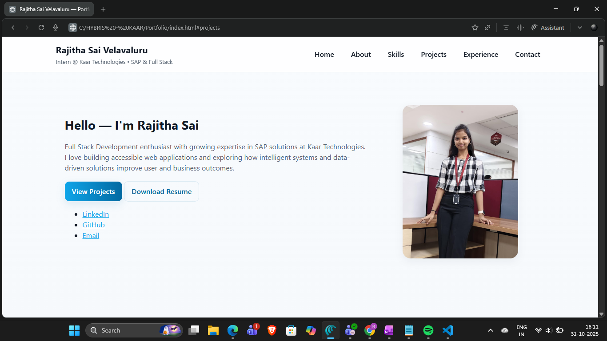
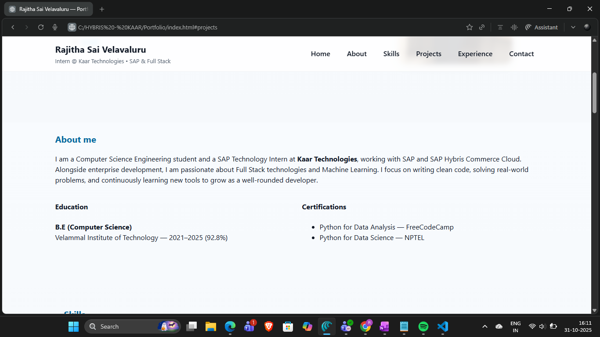

# 🌐 Rajitha Sai Velavaluru — Portfolio Website

Welcome to my personal portfolio! This site showcases my skills, projects, and professional journey as an aspiring Full Stack Developer and SAP Technology Intern.

🔗 **Live Portfolio:** *(Add link after hosting)*  
📍 Built With: HTML • CSS • JavaScript

---

## 🚀 About Me

I am a Computer Science Engineering student and currently a **SAP Technology Intern at Kaar Technologies**, working with SAP and SAP Hybris Commerce Cloud.  
Along with enterprise development, I am passionate about **Full Stack Development** and **Machine Learning**.  
I enjoy building clean, scalable applications that solve real-world problems.

---

## 🛠️ Tech Stack

### ⭐ Frontend
- HTML • CSS (Flexbox, Grid) • JavaScript

### ⭐ Backend / Enterprise Tech
- SAP Hybris Commerce Cloud
- SAP ERP • OData Services

### ⭐ ML & Data
- Python • CNNs
- Data Visualization • Model Deployment

### ⭐ Tools & Others
- GitHub • MS Office

---

## 📸 Portfolio Preview

Here’s a glimpse of my portfolio website design:

| Home Section | About Section |
|-------------|----------------|
|  |  |

*(Add your screenshots to assets folder and rename accordingly)*

---

## 📚 Featured Projects

| Project | Description | Tech |
|--------|-------------|------|
| **Blood Bank Prediction** | Time-series forecasting model to predict blood requirements | Python, ML |
| **Library Management System** | Java-based CRUD system for library operations | Java, SQL |
| **Handwriting Recognition** | CNN model deployed using Django + Streamlit | Python, CNN |
| **Automated Agriculture Monitoring** | ESP32-based IoT system for farmer alerts | C, IoT, GSM |

More projects are showcased on the website!

---

## 💼 Experience

| Role | Company | Duration |
|------|---------|----------|
| SAP Technology Intern | **Kaar Technologies** | Current |
| Intern — Machine Learning | Sirius-CDW Technologies | Jun 2023 – Jul 2023 |
| Java Development Intern | Young Mind Technologies | Jul 2024 – Aug 2024 |

---

## 📩 Contact Me

If you’re interested in internships, collaborations, or opportunities — feel free to connect! 🤝

- 📧 Email: rajitha191203@gmail.com  
- 🔗 LinkedIn: https://www.linkedin.com/in/rajitha-sai-velavaluru-34737a289  
- 💻 GitHub: https://github.com/velavalururajithasai  

---

📌 _Thank you for visiting my portfolio repo!_  
⭐ If you like my work, consider giving this repo a star!
